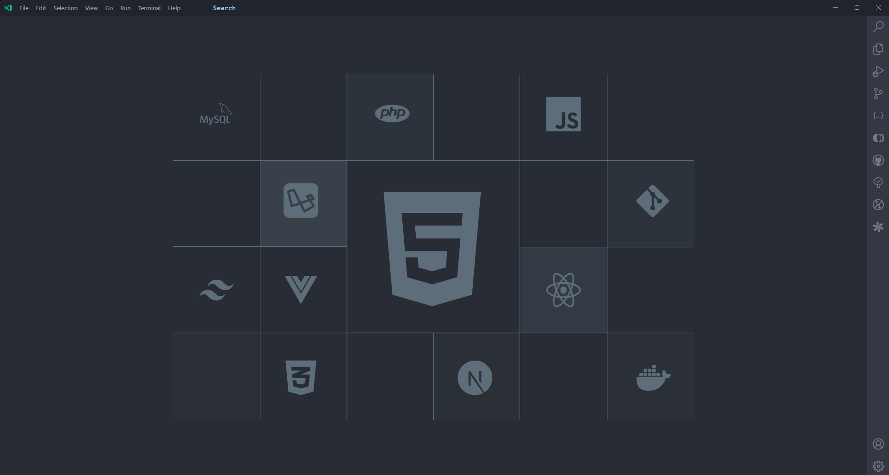
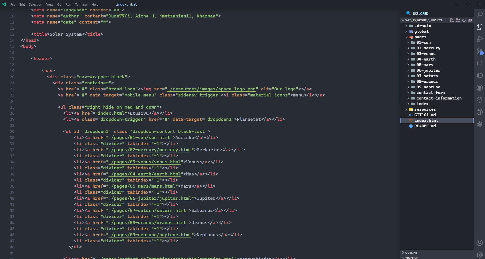
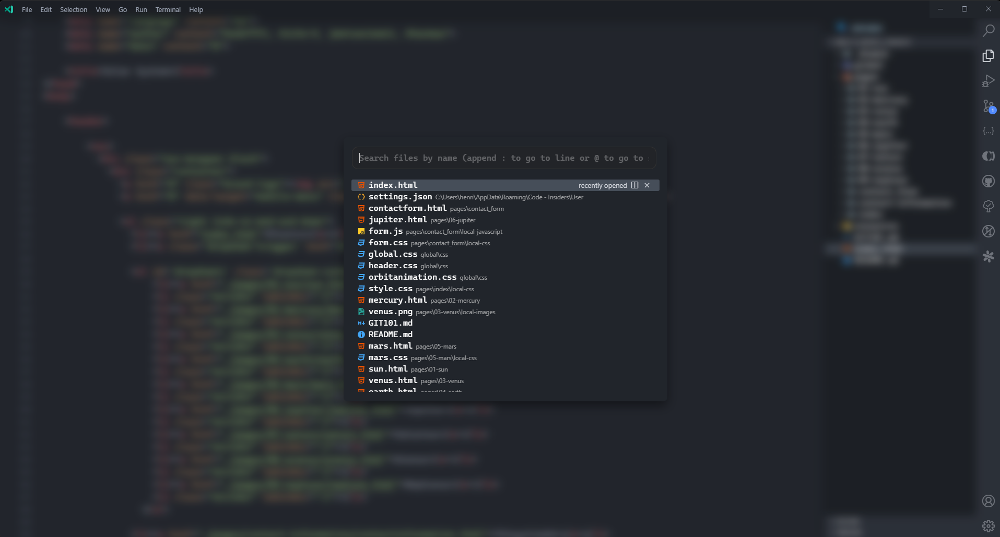

# VS Code Customization Repository

This repository holds all the settings, custom CSS, and JavaScript files I use to personalize my Visual Studio Code experience.

## custom CSS and JS

From [Glenn Raya's](https://www.youtube.com/watch?v=9_I0bySQoCs) youtube video

## How it looks

* **when the workspace is empty**

* **when you have a project open example HTML**

* **while using command palette**


## Features

* **Extensions:** [Listed here](./extensions.md)
* **Custom CSS:** Improve the look and feel of your code editor with custom styles.
* **Custom JavaScript:** Add additional functionality to VS Code through custom scripts.

## Installation

There are two ways to use these customizations in your VS Code environment:

**1. Using the "Custom CSS and JS Loader" extension:**

1. Install the "Custom CSS and JS Loader" extension from the VS Code Marketplace.
2. Copy the following settings to your VS Code User Settings (Code > Preferences > Settings):

```json
{
  "vscode_custom_css.imports": [
     "path/to/your/custom.css" // Replace with the path to your custom CSS file
     "path/to/your/custom.js" // Replace with the path to your custom JS file (optional)
  ],
}
```

* Make sure the paths in the settings point to the actual locations of your CSS and JS files within this repository (relative paths work).
* Enable "Custom CSS and JS Loader" from the VS Code command palette (Ctrl+Shift+P or Cmd+Shift+P on macOS).
* After making changes to your CSS or JS files, use the "Reload Custom CSS and JS" command in the command palette to see the updated styles and functionality.
